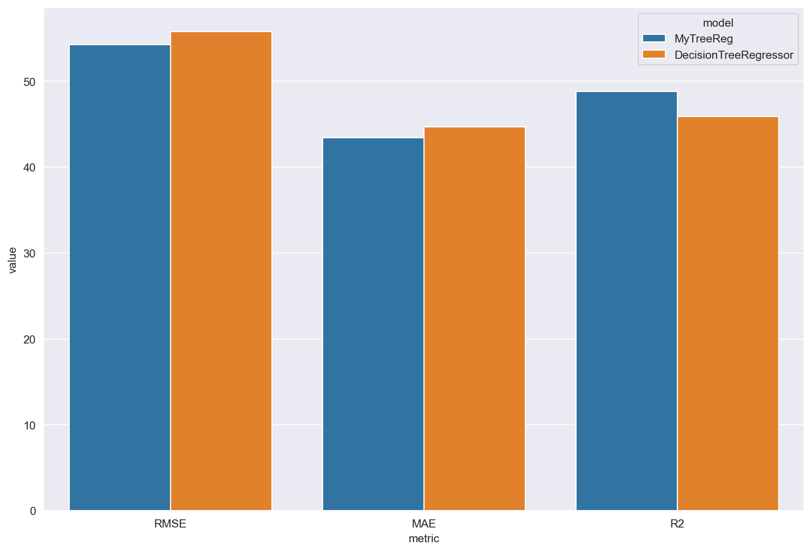
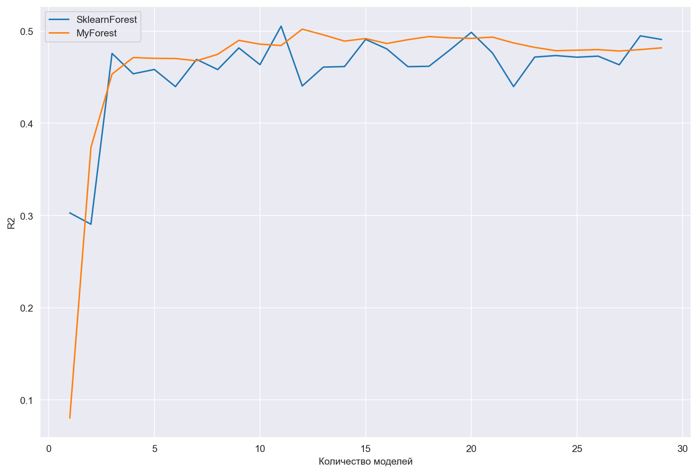
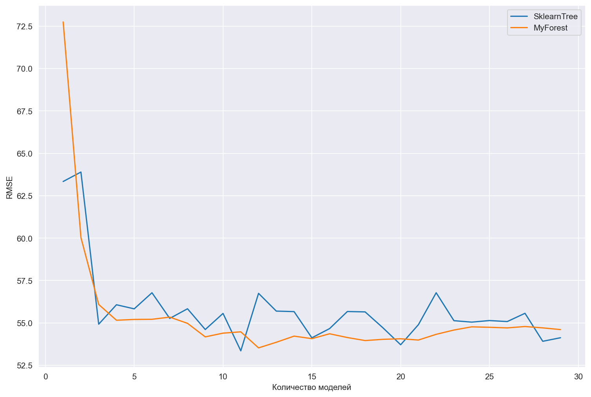
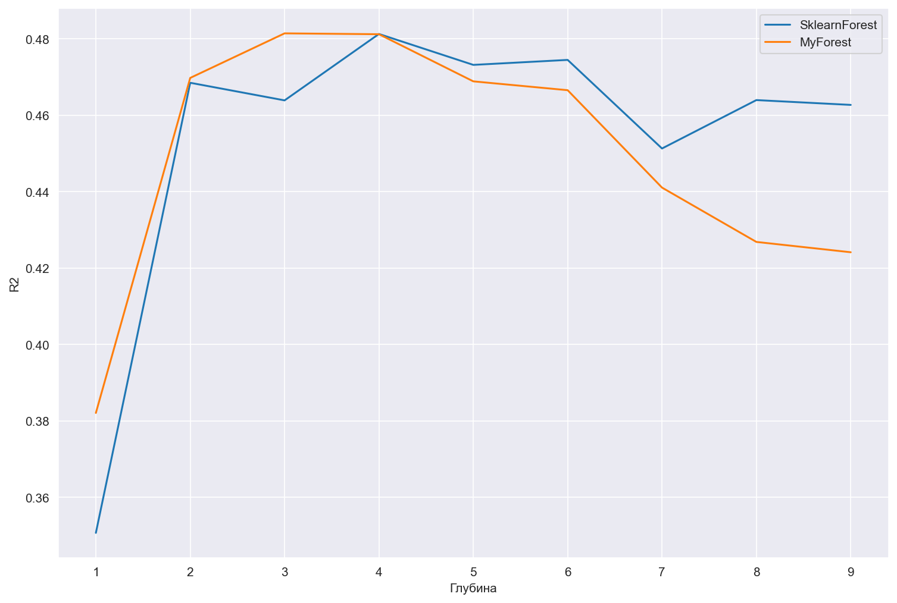
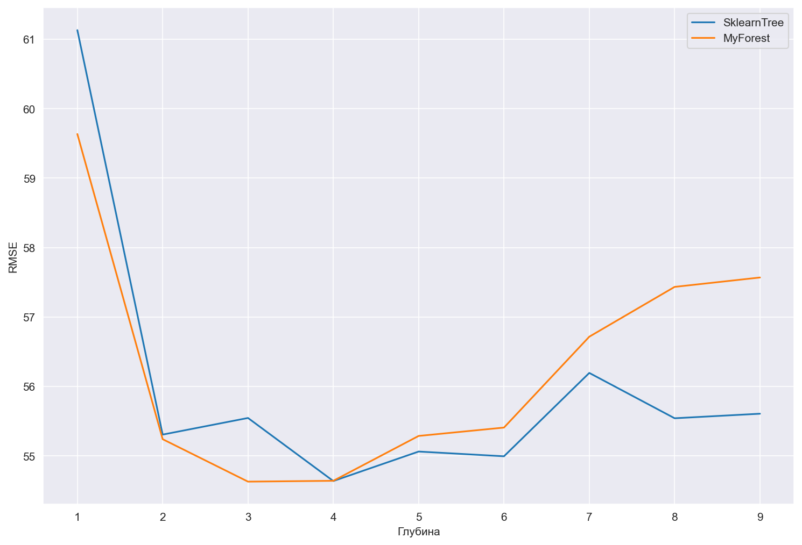
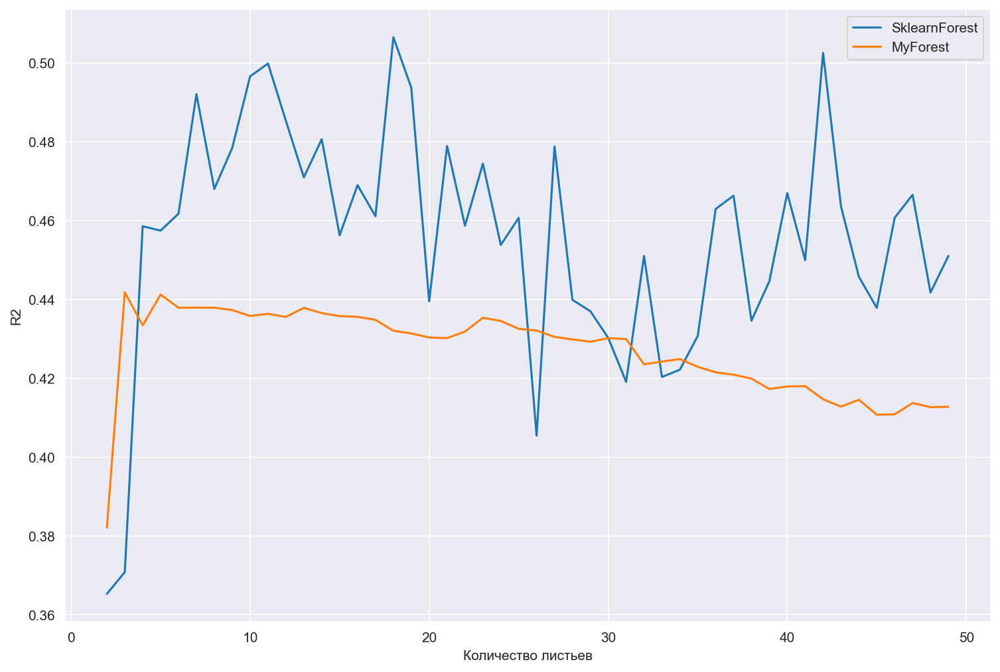
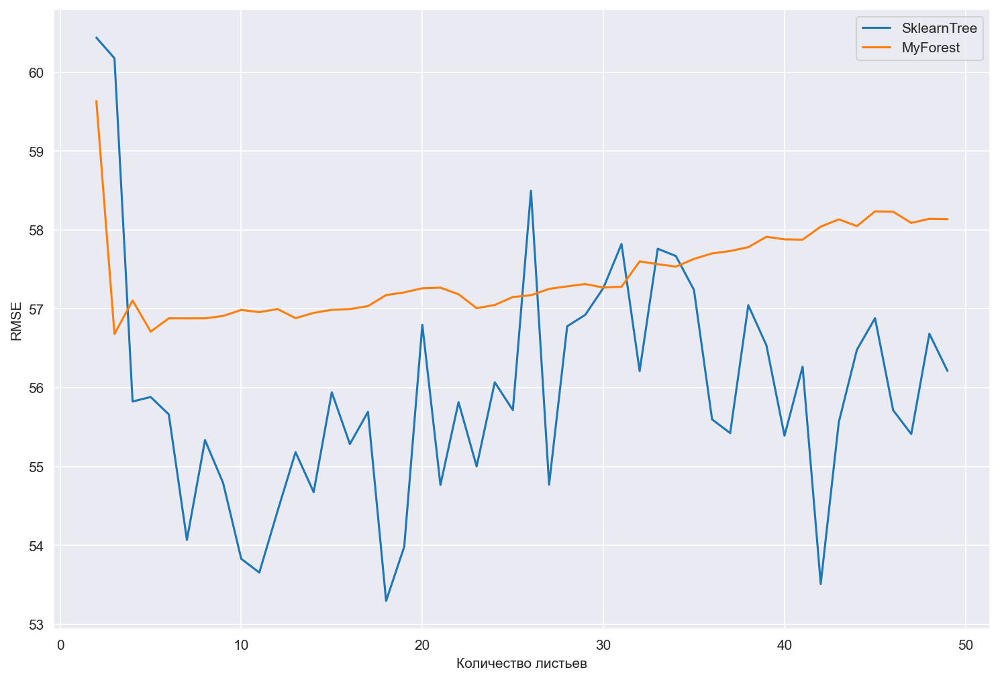

# Проект: Реализация случайного леса для регрессии с нуля (MyForestReg)

## Введение

Проект реализует **ансамблевый метод — случайный лес для регрессии** (Random Forest Regressor) на Python без использования готовых библиотек машинного обучения.

**Особенности реализации:**

- Поддержка ансамбля из `n_estimators` деревьев решений  
- Случайный отбор признаков и объектов для обучения каждого дерева  
- Разбиение по признакам с оптимальным порогом, минимизирующим MSE  
- Ограничения по глубине дерева, количеству листьев и минимальному числу объектов для разбиения  
- Поддержка дискретизации признаков через `bins` для ускорения обучения  
- Подсчёт важности признаков по суммарному уменьшению MSE  
- Поддержка оценки точности по OOB-принципу (Out-of-Bag Score)  
- Простая и понятная реализация, подходящая для обучения и визуализации работы случайного леса

**Цель проекта:** изучить устройство случайного леса для регрессии и реализовать его самостоятельно.  

---

## Теоретическая часть

### Модель случайного леса

Случайный лес — это ансамбль из нескольких регрессионных деревьев, обученных на случайных подвыборках данных и признаков. Финальное предсказание модели получается **усреднением** предсказаний всех деревьев.

---

### Алгоритм построения леса

1. Для каждого дерева:
   - Случайным образом выбирается подмножество признаков (feature bagging);
   - Случайным образом выбирается подмножество объектов (bootstrap sampling);
   - Обучается дерево с теми же параметрами, что и `MyTreeReg`.
2. Если включён режим `oob_score`, объекты, не попавшие в bootstrap-выборку, используются для оценки точности.
3. Важность признаков накапливается по всем деревьям ансамбля.

---

## Алгоритм построения отдельного дерева

1. На каждом узле ищется наилучший признак и порог разбиения, **максимизирующие уменьшение MSE**.  
2. Данные делятся на две группы по условию `feature <= split_value`.  
3. Рекурсивно строятся левое и правое поддеревья до выполнения одного из условий остановки:
   - достигнута максимальная глубина (`max_depth`),
   - в узле меньше минимального числа объектов (`min_samples_split`),
   - достигнут лимит по количеству листьев (`max_leafs`).  
4. Лист хранит среднее значение целевой переменной в соответствующей группе объектов.

---

## 📉 Критерий разбиения

Для выбора лучшего разбиения используется уменьшение среднеквадратичной ошибки (MSE):

$$
MSE(y) = \frac{1}{n}\sum_{i=1}^{n}(y_i - \bar{y})^2
$$

Чем больше уменьшение MSE после разбиения, тем лучше выбранный порог.  
Если улучшение не найдено — создаётся лист.

---

## Ограничения дерева

- `max_depth` — ограничивает глубину дерева, снижая переобучение.  
- `min_samples_split` — предотвращает разбиение узлов с малым количеством данных.  
- `max_leafs` — ограничивает общее число листьев.  
- `bins` — ускоряет обучение за счёт дискретизации признаков.

---

## Важность признаков

Важность признака вычисляется как суммарное уменьшение MSE, полученное при его использовании во всех деревьях леса:

$$
\text{Feature Importance} = \sum_{\text{все разбиения}} \Delta MSE
$$

Более важные признаки вносят больший вклад в качество модели.

---

## Предсказание

Метод `predict(X)` возвращает предсказанное значение целевой переменной для каждого объекта:

$$
\hat{y} = \frac{1}{n} \sum_{i=1}^{n} \hat{y}_i
$$

Предсказание каждого дерева усредняется по ансамблю.

---

## OOB-оценка (Out-of-Bag Score)

Если объект не попал в обучающую выборку для конкретного дерева, он используется для оценки точности.  
Поддерживаются следующие метрики:
- `mse` — среднеквадратичная ошибка  
- `rmse` — корень из MSE  
- `mae` — средняя абсолютная ошибка  
- `mape` — средняя относительная ошибка (%)  
- `r2` — коэффициент детерминации  

---

## Реализация (MyForestReg)

Класс `MyForestReg` поддерживает следующие параметры:

| Параметр              | Тип          | Описание                                                                 |
|------------------------|--------------|---------------------------------------------------------------------------|
| `n_estimators`         | int          | Количество деревьев в ансамбле                                          |
| `max_features`         | float        | Доля признаков, используемых в каждом дереве                             |
| `max_samples`          | float        | Доля объектов, используемых в каждом дереве                              |
| `random_state`         | int          | Фиксация генератора случайных чисел                                      |
| `max_depth`            | int          | Максимальная глубина дерева                                            |
| `min_samples_split`    | int          | Минимальное число объектов для разбиения                               |
| `max_leafs`            | int          | Максимальное количество листьев                                       |
| `bins`                 | int или None | Количество бинов для дискретизации признаков                            |
| `oob_score`            | str или None | Метрика для OOB-оценки (`'mse'`, `'mae'`, `'rmse'`, `'mape'`, `'r2'`)     |

---
## Сравнение собственной и встроенной реализаций

* Были взяты значения по умолчанию
* Для удобства R2 был умножен на 100

## Зависимость R2 от количества моделей
* Максимальное количество листьев - 30
* Максимальная глубина дерева - 10

## Зависимость RMSE от количества моделей
* Максимальное количество листьев - 30
* Максимальная глубина дерева - 10

## Зависимость R2 от глубины дерева
* Количество моделей - 15
* Максимальное количество листьев - 30

## Зависимость RMSE от глубины дерева
* Количество моделей - 15
* Максимальное количество листьев - 30

## Зависимость R2 от количества листьев
* Количество моделей - 15
* Максимальная глубина дерева - 10

## Зависимость RMSE от количества листьев
* Количество моделей - 15
* Максимальная глубина дерева - 10

